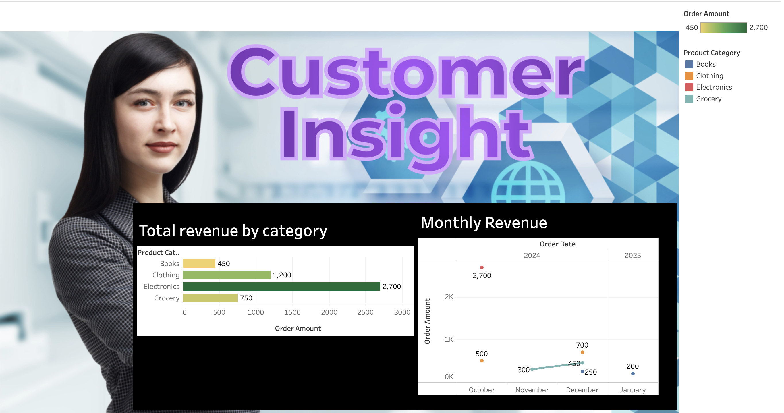

# 🚗 Driver Demand Prediction

This is a machine learning project that predicts food delivery driver demand (or delivery time) based on real-world conditions such as weather, traffic, and distance. It uses Python and scikit-learn for modeling and visualization.

---

## 🔍 Problem Statement

To estimate the time required for delivery using key features such as:
- Distance to be covered
- Weather conditions
- Traffic density

---

## 📊 Dataset

- **Source**: [Kaggle - Food Delivery Dataset](https://www.kaggle.com/datasets/gauravmalik26/food-delivery-dataset)
- **File in Repo**: `driver-demand-prediction.csv`

---

## 🛠️ Tools Used

- Python
- pandas, numpy
- matplotlib, seaborn
- scikit-learn (Linear Regression)

---

## 📈 Highlights

- Model: Linear Regression
- Evaluation Metrics: R² Score, Mean Absolute Error (MAE)
- Visuals: Scatter plots for predictions

---

## 📁 Project Files

- 📘 [Notebook_Driver_Demand_Prediction.ipynb](Notebook_Driver_Demand_Prediction.ipynb)
- 📄 [driver-demand-prediction.csv](driver-demand-prediction.csv)
- 🧾 [requirements.txt](requirements.txt)

---
## 🧭 SQL + Tableau Project: Customer Purchase Insights

📊 Live dashboard hosted on Tableau Public  
👉 [View it here](https://public.tableau.com/app/profile/sandeep.kumar.mishra2976/viz/CustomerPurchaseInsightsDashboard/CustomerPurchaseInsightsDashboard)

### 📦 Dataset  
- [customer_data.csv](./customer_data.csv)

### 🔍 Features
- Revenue breakdown by category
- Monthly order trends
- Interactive filters

## 👨‍💻 Author

**Sandeep Kumar Mishra**  
Data Analyst | Tableau Certified | IISc Data Science Graduate  
[LinkedIn](https://www.linkedin.com/in/sandeep-kumar-mishra) *(replace with actual link)*

---

🌐 View Full Repository: [driver-demand-prediction on GitHub](https://github.com/sandeep-1531/driver-demand-prediction)
